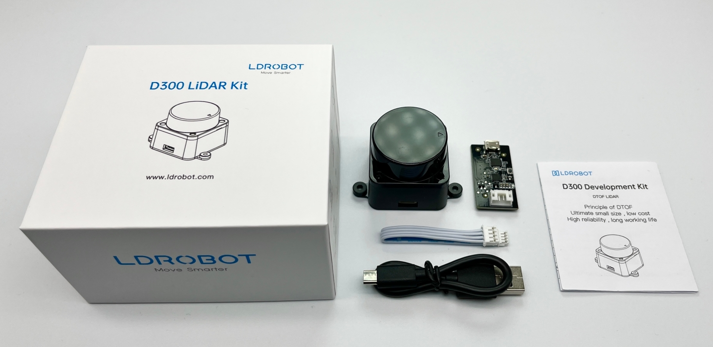

## 1. D300 LiDAR Kit
### 1.1. Components

- DTOF LDROBOT LiDAR LD19 
- CP2102 Adapter Panel and Connecting Line 
- LiDAR LD19 Datasheet and Development Manual 

### 1.2. Features

- Good performance, low cost and highly cost effective 
- 360° scanning for ranging 
- Small ranging error, good ranging stability and high precision 
- Based on DTOF ranging principle, its ranging scope is wide at 0.02-12m 
- Low power consumption, small size, stable performance and sound endurance. 
- Abundant available data and technical support 

### 1.3. Application field

- Mapping, navigation and obstacle avoidance of mobile robot SALM 
- ROS education robot, Maker project 
- Service robot 
- Robot cleaner 

### 1.4. Data Collection

- LiDAR Datasheets and Development Manuals
   - [https://github.com/ldrobotSensorTeam/DeveloperKit/releases](https://github.com/ldrobotSensorTeam/DeveloperKit/releases)
- LiDAR ROS Driver Package
   - [https://github.com/ldrobotSensorTeam/ldlidar_stl_ros](https://github.com/ldrobotSensorTeam/ldlidar_stl_ros)
   - [https://gitee.com/ldrobotSensorTeam/ldlidar_stl_ros](https://gitee.com/ldrobotSensorTeam/ldlidar_stl_ros)
- LiDAR ROS2 Driver Package
   - [https://github.com/ldrobotSensorTeam/ldlidar_stl_ros2](https://github.com/ldrobotSensorTeam/ldlidar_stl_ros2)
   - [https://gitee.com/ldrobotSensorTeam/ldlidar_stl_ros2](https://gitee.com/ldrobotSensorTeam/ldlidar_stl_ros2)
- LiDAR Linux SDK Package：
   - [https://github.com/ldrobotSensorTeam/ldlidar_stl_sdk](https://github.com/ldrobotSensorTeam/ldlidar_stl_sdk)
   - [https://gitee.com/ldrobotSensorTeam/ldlidar_stl_sdk](https://gitee.com/ldrobotSensorTeam/ldlidar_stl_sdk)
- LiDAR 3D Model File Download
   - [https://github.com/ldrobotSensorTeam/Product_3D_model/releases](https://github.com/ldrobotSensorTeam/Product_3D_model/releases)
- LiDAR point cloud visualization software download
   - [https://github.com/ldrobotSensorTeam/ld_desktop_tool/releases](https://github.com/ldrobotSensorTeam/ld_desktop_tool/releases)
- Introduction to customized image of Raspberry Pi application
   - [https://github.com/ldrobotSensorTeam/ldlidar_stl_ros/wiki](https://github.com/ldrobotSensorTeam/ldlidar_stl_ros/wiki)
###   1.5. Support

- Method I: Send questions to` support@ldrobot.com`
- Method II: Submit relevant issues on our team's GitHub or Gitee repository
